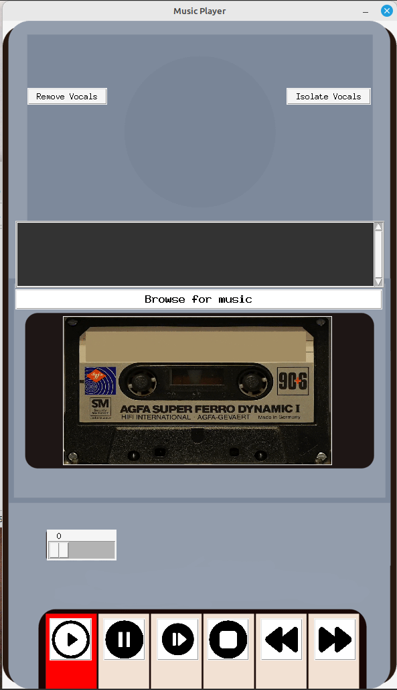

# Tkinter Music Player  

A desktop music player built with **Python, Tkinter, and Pygame**.  
It lets you browse and play `.mp3` files, control playback, adjust system volume, and even process audio to **remove or isolate vocals**.  
The interface simulates a cassette player with an animated GIF while music is playing.  

---

## Features  

- Play, pause, unpause, stop music  
- Previous / Next song navigation  
- Browse and load a music folder into the playlist  
- Adjustable system volume (via ALSA + pygame)  
- Playlist support with scrollable listbox  
- Animated cassette GIF while playing  
- **Audio processing**:  
  - Remove vocals (karaoke effect)  
  - Isolate vocals (voice extraction)  

---

## Requirements  

Make sure you have **Python 3.8+** installed.  
Install dependencies with:  

```bash
pip install pygame pillow python-resize-image pydub librosa soundfile pyalsaaudio

```

Also, make sure ffmpeg is installed on your system (required by pydub).
For Ubuntu/Debian:

```bash

sudo apt install ffmpeg

```
## Usage

1. Clone this repo:
   
```bash
git clone https://github.com/yourusername/music-player.git
cd music-player
```
2. Run the app:
```bash
python main.py
```

3. Use the Browse for music button to select a folder with .mp3 files.

4. Control playback with the buttons.

5. Use "Remove Vocals" or "Isolate Vocals" for audio processing (output saved in dedicated folders).

## Project Structure
```bash
.
├── main.py                # Main application
├── images/                # UI icons & background
│   ├── cassette-player.png
│   ├── play.png
│   ├── pause.png
│   ├── next.png
│   └── ...
├── isolated-vocals/       # Output folder for isolated vocals
├── vocals-removed/        # Output folder for karaoke tracks
└── README.md

```

## UI Preview 



## Notes

- Works best on Linux (uses alsaaudio for system volume).

- On Windows/macOS, system volume control may not work as intended.

- Audio processing can take some time depending on file size.
